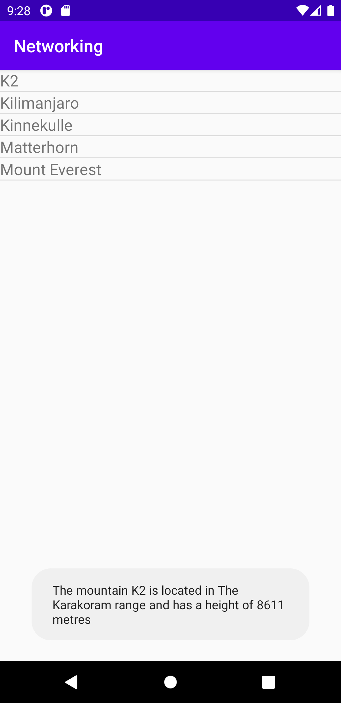

# Rapport
**1. Added ListView to layout**:

ListView tillades genom layout --> activity_main tillsammans med en ny resource file namngiven
listview_item med rotelement TextView. Bäggedera angavs ett id för att möjliggöra tillkallning av
dessa vid komplett framställning av en listview.

Inuti activity_main:
```
    <ListView
        android:id="@+id/list_view"
        android:layout_width="match_parent"
        android:layout_height="match_parent"
        app:layout_constraintBottom_toBottomOf="parent"
        app:layout_constraintLeft_toLeftOf="parent"
        app:layout_constraintRight_toRightOf="parent"
        app:layout_constraintTop_toTopOf="parent"
        />
```

Inuti listview_item.xml:
```
<TextView xmlns:android="http://schemas.android.com/apk/res/android"
    android:id="@+id/item"
    android:layout_width="match_parent"
    android:layout_height="wrap_content"
    android:text="Text"
    android:textSize="18sp" />
```

Tillåtelse till nternet tillades i AndroidManifest.xml för att kunna hämta datan från webservicen.
```
   <uses-permission android:name="android.permission.INTERNET" />
```


**2. Added ArrayList<Mountain> as a member variable in activity**:

En deklaration av ArrayList kallad för <Mountain> items; skapades för att kunna inkorporera den genom
 tilldelning i adaptern för att kunna använda dess innehåll.

```
    private ArrayList<Mountain> items;
```
Adapter tillades för att kunna läsa in datan från webservicen och visa upp den i ListView.
ListView kallades genom nedanstående kod där det angavs att adaptern på denna screen: MainActivity, skulle
layouten listview_items uppvisas inuti TextView med id item med innehållet från arraylistan items.

Deklaraktion av adapter:
```
    private ArrayAdapter<Mountain> adapter;
```
Tilldelning av adapter:
```
adapter = new ArrayAdapter<Mountain>(MainActivity.this,R.layout.listview_item, R.id.item, items);
```

För att kunna skapa en toast i senare skede skapades private member variables identiska mot JSON datan.
Detta genomfördes genom att skapa en java class för Mountain. Däri tillades nedanstående kod där private
String användes för textstränger medan int för numeriska värden.
toString ersattes med 'get...()' som uppspelades i toast meddelandet.
```
public class Mountain {

    private String ID;
    private String name;
    private String type;
    private String company;
    private String location;
    private String category;
    private int size;
    private int cost;
    private Auxdata auxdata;


    public String getName() { return name;}

    public String getLocation() { return location;}

    public int getSize() { return size;}

    public Auxdata getAuxdata() { return auxdata;}

    @Override
    public String toString() { return name;}
```


**3. Use 'JsonTask' to fetch data from our json web service**:

Bergslistan hämtades genom att ange dess URL och genom användning av JsonTask.
```
        new JsonTask().execute("https://wwwlab.iit.his.se/brom/kurser/mobilprog/dbservice/admin/getdataasjson.php?type=brom");
```


**4. Add items to your list of mountains by parsing the json data**:

I onPostExecute skapades ett nytt gson objekt instans för att tolka strängen med den skapade klassen
genom Mountain[] mountains = gson.fromJson(json, Mountain[].class);.
Genom 'add' tillades alla bergen en efter en. Därefter kördes adapter.notifyDataSetChange för att
informera adaptern om förändringar som skett i listan av datan. På detta vis uppdaterades adaptern
med den nya datan.


```
   @Override
    protected void onPostExecute(String json) {
        try {
            Log.d("AsyncTask", json);
            Gson gson = new Gson();
            Mountain[] mountains = gson.fromJson(json, Mountain[].class);
            adapter.clear();
            for (int i = 0; i < mountains.length; i++) {
                Log.d("MainActivity ==>", "Hittade ett berg: " + mountains[i]);
                adapter.add(mountains[i]);
            }
            adapter.notifyDataSetChanged();
        } catch (Exception e) {
            Log.e("MainActivity ==>", "Something went wrong.");
        }
```


*5. Added Mountain name and 2 other properties as a Toast View*:

Genom onCLickItemListner hämtades motsvarande item genom Mountain mountain = items.get(position);
i samband med meddelandet i String message som uppvisades i form av en toast med hjälp av adapter.

```
        ListView listView = findViewById(R.id.list_view);
        listView.setAdapter(adapter);
        listView.setOnItemClickListener(new AdapterView.OnItemClickListener() {
            @Override
            public void onItemClick(AdapterView<?> parent, View view, int position, long id) {

               Mountain mountain = items.get(position);

               String message = "The mountain " +  mountain.getName() + " is located in " +
                       mountain.getLocation() + " and has a height of " + mountain.getSize() + " metres ";
                Toast.makeText(MainActivity.this, message, Toast.LENGTH_LONG).show();
            }
        });
```




*Bild 1: Uppvisar den färdigställda applikationen med ett toast meddelande angående information om K2*

